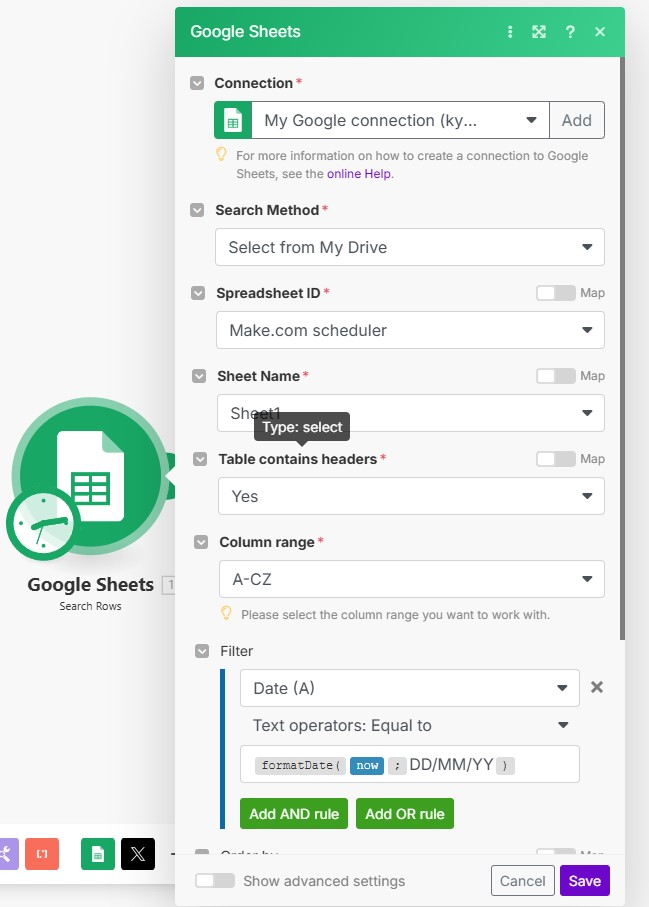
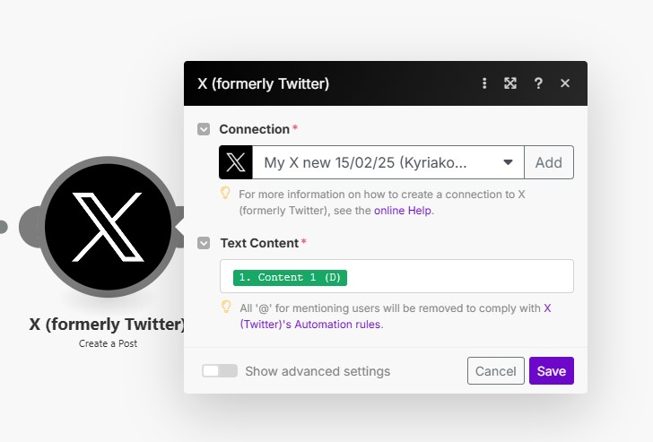

# Tweet Scheduler with Make.com Automation 🚀

Hi there! This is a cool tool that helps you schedule tweets and post them automatically. It's like having a robot helper that posts your tweets for you! 

## What You'll Need 🛠️

1. An OpenAI API key (ask your parents/guardian to help you get one)
2. A Google account with Google Sheets
3. A Make.com account (it's free to start!)
4. A Twitter/X account

## Google Sheets Structure 📊

Your Google Sheet should have these columns(Will be created by the program):
```
| Type | Content | Characters | Image | Video | Status | Date | Time |
|------|---------|------------|--------|-------|--------|------|------|
| 1    | Tweet 1 | 240        | URL1   | -     | Ready  | 2/16 | 9:00 |
| 2    | Tweet 2 | 180        | URL2   | -     | Ready  | 2/16 | 9:30 |
```

## Setting Up Make.com Automation 🔄


### Step 1: Google Sheets Trigger


1. Add "Google Sheets" trigger
2. Select your spreadsheet
3. Set it to watch for new rows
4. Choose your sheet name
5. Set Table contains headers = Yes
6. Set Column range = A-H (Type through Time)

### Step 2: Twitter/X Posting


For each scenario (1, 2, 3, etc.):
1. Add "Create a Tweet" action
2. Connect your Twitter/X account
3. Set up the mapping:
   - Text = Content column
   - Media = Image column (if exists)
   - Video = Video column (if exists)

### Important: Multiple Scenarios 📝

You need separate scenarios for each type:

**Scenario 1:**
```
Filter: Where Type equals "1"
Tweet using: Content 1, Image 1, Video 1
```

**Scenario 2:**
```
Filter: Where Type equals "2"
Tweet using: Content 2, Image 2, Video 2
```

And so on...

## Using the Tweet Scheduler 🐦

1. Start the program:
   ```bash
   # First, start the backend
   python backend/app.py

   # Then, in another window, start the frontend
   npm run dev
   ```

2. Open your web browser and go to: http://localhost:5173 or 5174

3. Add content in two ways:
   - **Paste Images**: 
     - Click in the "Instructions" box
     - Press Ctrl+V to paste screenshot
     - AI will extract text and create variations
   
   - **Type Directly**:
     - Enter tweets in the text box
     - AI will process and format them

4. The program will automatically:
   - Extract text from images
   - Generate tweet variations
   - Format everything properly
   - Add to your Google Sheet with:
     - Type (1, 2, 3, etc.)
     - Content (the tweet text)
     - Character count
     - Image URLs (if any)
     - Video URLs (if any)
     - Status (Ready)
     - Date and Time

5. Make.com will then:
   - Watch for new rows
   - Filter by Type
   - Post at scheduled times
   - Update Status

## Example Flow 🌊

1. You paste a tweet screenshot
2. AI extracts: "Just learned coding! What should I learn next?"
3. Gets saved to sheet as:
   ```
   Type 1 | "Just learned coding! What should I learn next?" | 45 | - | - | Ready | 2/16 | 10:00
   ```
4. Make.com sees new row
5. Matches Type = 1 scenario
6. Posts to Twitter/X
7. Updates Status to "Posted"

## Need Help? 🆘

If something goes wrong, check:
1. Google Sheet structure matches exactly
2. Make.com scenarios are filtering correctly
3. All connections are active
4. API keys are valid

## Stay Safe! 🔒

Remember:
- Keep your API keys private
- Double-check tweet content
- Monitor your automation

Have fun scheduling your tweets! 🎉
