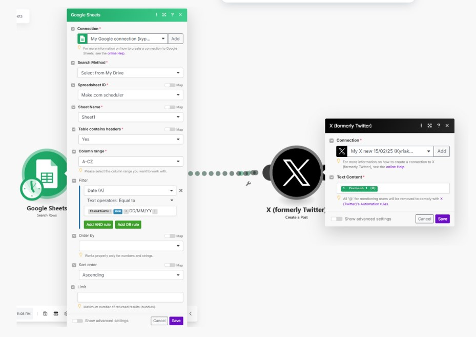

# Tweet Creation from Articles/Screenshots
# & Scheduler with Make.com


A web application that helps create and schedule engaging tweets from various content sources. The app processes text and images, generates tweet variations using GPT-4, and allows scheduling through Google Sheets integration.





## Features

- **Content Processing**
  - Process text input into tweet-friendly format
  - Extract text from images using GPT-4 Vision
  - Process articles from URLs using crawl4ai
  - Maintain original message with minimal adjustments

- **Viral Hooks Inspiration**
  - Browse different categories of viral hooks
  - Search and filter hooks
  - Copy hooks to clipboard
  - Categories: Question, Challenge, Story, Authority, Stats

- **Two-Step Publishing**
  1. Process content and review generated tweets
  2. Schedule approved tweets to Google Sheets

## Setup

1. Clone the repository:
```bash
git clone [repository-url]
cd tweet-scheduler
```

2. Backend Setup (Choose A or B):

**Option A: Using Conda (Recommended)**
```bash
# Create and activate conda environment from yml
conda env create -f environment.yml
conda activate tweet-scheduler
```

**Option B: Using Python venv**
```bash
# Create and activate virtual environment
python -m venv venv
source venv/bin/activate  # On Windows: venv\Scripts\activate
pip install -r requirements.txt
```

3. Frontend Setup:
```bash
# Install Node.js dependencies
npm install
```

4. Start the Application:
```bash
# Terminal 1: Start Frontend
npm run dev

# Terminal 2: Start Backend
python backend/app.py
```

### Configuration

Create `config.json` in project root:
```json
{
  "openai_api_key": "your-openai-key",
  "google_sheets_credentials_file": "./credentials.json",
  "google_sheets_id": "your-sheet-id-from-url"
}
```

## Usage

1. **Content Input**
   - Paste text directly
   - Upload/paste images
   - Enter article URLs

   

2. **Processing**
   - Click "Process Tweets" to generate tweet variations
   - Review and edit generated tweets in textarea

   

3. **Scheduling**
   - Review processed tweets
   - Click "Send to Google Sheets" to schedule

   

4. **Viral Hooks**
   - Browse hook categories for inspiration
   - Search for specific hooks
   - Copy hooks to use in tweets

   

## Tech Stack

- **Frontend**
  - React
  - Vite
  - CSS Modules

- **Backend**
  - Flask
  - OpenAI GPT-4
  - Google Sheets API
  - crawl4ai (for article extraction)

## Project Structure

```
├── backend/
│   ├── app.py                 # Main Flask application
│   ├── GPT4_make_scheduler.py # Tweet processing logic
│   ├── vision_processor.py    # Image processing
│   ├── article_processor.py   # URL processing
│   └── hooks_config.py        # Viral hooks configuration
├── src/
│   ├── components/            # React components
│   ├── config/               # Frontend configuration
│   └── App.jsx               # Main React component
├── shared/
│   └── hooks.json            # Shared hooks data
└── scripts/
    └── sync_hooks.py         # Hooks synchronization
```

## Contributing

1. Fork the repository
2. Create your feature branch (`git checkout -b feature/amazing-feature`)
3. Commit your changes (`git commit -m 'Add amazing feature'`)
4. Push to the branch (`git push origin feature/amazing-feature`)
5. Open a Pull Request

## License

This project is licensed under the MIT License - see the LICENSE file for details.
