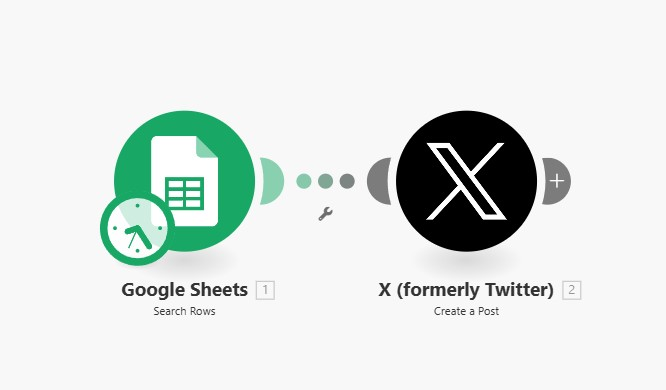
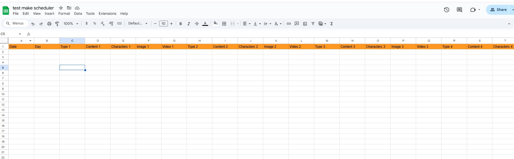

# Tweet Scheduler with Make.com Automation 🚀

A tool that helps you automatically schedule and post tweets. It can read screenshots or text input, create variations, and post them automatically using Make.com.

## Make.com Automation Overview



## The Problem 🤔
Creating and scheduling tweets can be challenging, especially when you want to:
1. Extract content from tweet screenshots
2. Generate tweet variations
3. Schedule them automatically
4. Maintain a consistent posting schedule

While Make.com offers great automation for posting tweets, it doesn't help with content creation and management. Similarly, while Google Sheets is perfect for organizing content, it doesn't connect directly to tweet creation.

## The Solution 💡
This tool solves these problems by combining:
1. **AI-Powered Content Generation**:
   - Extract text from screenshots
   - Generate variations of existing tweets
   - Create new tweets from your input

2. **Google Sheets Organization**:
   - Structured storage of tweets
   - Automatic scheduling setup
   - Content management system

3. **Make.com Automation**:
   - Automatic posting to Twitter/X
   - Multiple posting schedules
   - Different content types per scenario

This combination creates a powerful workflow:
```
Screenshot/Text → AI Processing → Google Sheets → Make.com → Twitter
```

## Setup Guide

### Step 1: OpenAI API Setup
1. Go to [OpenAI's website](https://platform.openai.com/signup)
2. Create an account or sign in
3. Click on your profile icon → View API Keys
4. Click "Create new secret key"
5. Copy your API key (you'll need it later)

### Step 2: Google Setup
1. Go to [Google Cloud Console](https://console.cloud.google.com/)
2. Create a new project
3. Enable Google Sheets API:
   - Search for "Google Sheets API"
   - Click "Enable"
4. Create credentials:
   - Go to "Credentials" in left menu
   - Click "Create Credentials" → "Service Account"
   - Fill in service account details
   - Click "Done"
5. Download credentials:
   - Click on your new service account
   - Go to "Keys" tab
   - Add Key → Create New Key → JSON
   - Save the downloaded file as "fotogenie-ai-credentials.json"
6. Create a Google Sheet:
   - Go to [Google Sheets](https://sheets.google.com)
   - Create a new sheet
   - Copy the sheet ID from URL (the long string between /d/ and /edit)
   - Share the sheet with the email from your credentials file

### Step 3: Make.com Setup
1. Create account at [Make.com](https://www.make.com)
2. Create a new scenario
3. Set up Google Sheets trigger:
   
   - Add "Google Sheets" trigger
   - Connect your Google account
   - Select your spreadsheet
   - Watch for new rows
   - Set "Table contains headers" to Yes

4. Add Twitter/X posting:
   
   - Add "Create a Tweet" action
   - Connect your Twitter account
   - Map the columns:
     - Text = Content column
     - Media = Image column
     - Video = Video column

5. Create multiple scenarios:
   
   - Duplicate your scenario for each type
   - In each scenario, filter by Type number
   - Example:
     ```
     Scenario 1: Filter where Type = "1"
     Scenario 2: Filter where Type = "2"
     etc.
     ```

### Step 4: Environment Setup
1. Install Conda if you haven't already:
   - Download [Miniconda](https://docs.conda.io/en/latest/miniconda.html)
   - Follow installation instructions for your system

2. Create and activate the environment:
   ```bash
   # Create environment
   conda env create -f environment.yml

   # Activate environment
   conda activate tweet_scheduler
   ```

3. Run the setup script:
   ```bash
   python setup.py
   ```

4. Verify Playwright installation:
   ```bash
   python -c "from playwright.sync_api import sync_playwright; sync_playwright().start()"
   ```

If you get any browser errors, you can manually install them:
```bash
playwright install
playwright install-deps
```

### Step 5: Program Setup
1. Rename the configuration template:
   ```bash
   # On Windows
   copy config.json.example config.json

   # On Mac/Linux
   cp config.json.example config.json
   ```

2. Edit config.json with your details:
   ```json
   {
     "openai_api_key": "your-openai-api-key-from-step-1",
     "google_sheets_id": "your-sheet-id-from-step-2",
     "google_sheets_credentials_file": "your-google-project-credentials.json"
   }
   ```

3. Install frontend dependencies:
   ```bash
   # Install Node.js dependencies
   npm install
   ```

## Using the Program

1. Make sure your environment is activated:
   ```bash
   # On Windows
   conda activate tweet_scheduler
   # On Mac/Linux
   source activate tweet_scheduler
   ```

2. Start the services:
   ```bash
   # Start backend (in the activated environment)
   python backend/app.py

   # In new window, start frontend
   npm run dev
   ```

3. Open in browser: http://localhost:5173 or 5174

4. Add tweets two ways:
   - **From Screenshots**: 
     - Click "Instructions" box
     - Press Ctrl+V to paste screenshot
   
   - **Type Manually**:
     - Enter tweets in text box

5. Click "Schedule Tweets"

The program will:
- Process your input
- Create tweet variations
- Add them to Google Sheets
- Make.com will post them automatically

## Sheet Structure
The program creates this structure automatically:
```
| Type | Content | Characters | Image | Video | Status | Date | Time |
|------|---------|------------|--------|-------|--------|------|------|
| 1    | Tweet 1 | 240        | URL1   | -     | Ready  | 2/16 | 9:00 |
```

## Troubleshooting

If you get errors:
1. Check all API keys are correct
2. Ensure Google Sheet is shared correctly
3. Verify Make.com scenarios are running
4. Check your internet connection

## Security Note ⚠️
Never share your:
- config.json file
- API keys
- Credentials file

Need help? Open an issue on GitHub!
